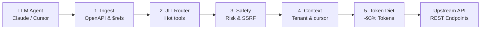

## Architectural Philosophy

PostMCP operates on a modular, pipeline-oriented architecture designed to sit between LLM agents (clients) and REST API endpoints (targets). Instead of treating OpenAPI specifications as static documentation files, PostMCP treats them as dynamic, queryable state machines.

---

## The Request Lifecycle

Every tool call dispatched by an AI agent traverses five distinct stages:

### Stage 1: Specification Ingestion & Normalization

When a spec is loaded (from a local file, remote URL, or preset alias):
1. **Parser Execution**: Supports Swagger 2.0, OpenAPI 3.0.x, and OpenAPI 3.1.x.
2. **Ref Resolution**: Resolves internal pointers (`#/components/schemas/...`) and external remote JSON schemas into self-contained objects.
3. **Parameter Consolidation**: Path-level parameters are combined with operation-level parameters, with duplicate keys correctly scoped.
4. **Operation ID Sanitization**: Missing `operationId` values are deterministically generated from the HTTP method and path template (e.g. `get_v1_users_id`).
5. **Vendor Extensions**: Extracts custom extensions (`x-hot-tool`, `x-diet-mask`, `x-risk-tier`) and preserves them for downstream routing.

### Stage 2: Tool Registry & Hybrid JIT Routing

To balance tool availability with token conservation, PostMCP uses a **Hybrid Just-In-Time (JIT)** registry:
- **Hot-Tool Selection**: Evaluates endpoints based on structural heuristics (root collection GET routes, primary entity endpoints) and explicit metadata (`x-hot-tool`). The top 5 to 7 tools are mounted immediately upon server startup.
- **Dynamic Meta-Tool**: Exposes `tool_search`, enabling the LLM to search across unmounted operations by keyword, tag, or category.
- **On-Demand Mounting**: When the agent requests a tool via `tool_search`, PostMCP dynamically mounts the operation into the active toolset.
- **LRU Eviction**: When total mounted tools exceed configured thresholds (`maxMountedTools`), least recently used tools are unmounted to conserve prompt space.

### Stage 3: Safety Classification & Dry-Run Interception

Before any network request is created:
- **Risk Assessment**: The operation is classified into one of three tiers:
  - `READ_ONLY`: Safe, idempotent GET requests.
  - `MUTATION`: State-changing requests (POST, PUT, PATCH, DELETE).
  - `CRITICAL`: High-impact administrative actions (billing, destruction, token revocation).
- **Dry-Run Interception**: If dry-run mode is enabled (via CLI flag `--dry-run` or Studio toggle), mutation and critical requests are intercepted. PostMCP returns a synthesized JSON response confirming the simulated success of the operation without touching upstream production systems.
- **SSRF Defense**: In web-hosted environments, target URLs are validated against private IP blocks (RFC 1918, link-local, loopback, and cloud metadata addresses like `169.254.169.254`).

### Stage 4: Context Injection & Upstream Execution

When executing live requests:
- **Auto-Tenant Injection**: If an operation expects an organization, team, or account identifier (such as `org_id` or `team_id`), but the agent omitted it, PostMCP queries its context cascade:
  1. Environment variables (e.g., `NEON_ORG_ID`, `STRIPE_ACCOUNT_ID`, `ORG_ID`).
  2. Dynamic identity endpoints (e.g., `/users/me/organizations`).
  3. Default workspace configurations.
- **Internal Auto-Pagination**: If an endpoint returns a cursor (`next_cursor`, `starting_after`, `offset`), PostMCP automatically follows pagination internally up to 3 pages and merges the items. This ensures the model receives a complete collection without wasting roundtrips or entering hallucinated pagination loops.

### Stage 5: Token Diet Pruning & Compression

Before the response returns to the LLM:
- **HTML Stripping**: Eliminates markup tags, styling, and doctype noise from error responses or rich text fields.
- **Markdown Table Serialization**: Converts arrays of uniform objects into compact Markdown tables, stripping repeated JSON keys and punctuation.
- **JSONPath Field Masking**: Applies pre-tuned or user-defined JSONPath queries (e.g. `items[*].{id,name,status,created_at}`) to discard non-essential metadata.
- **Explicit Truncation Markers**: If payloads exceed byte or token limits, PostMCP cleanly trims the content and appends `[Data truncated by design. Total items: N]`, notifying the agent that truncation was intentional.

---

## Execution Modes: Runtime Proxy vs Code Generation

PostMCP supports two deployment models:

### 1. Runtime Proxy Mode (`postmcp run`)
In proxy mode, PostMCP acts as a live mediator. It reads the OpenAPI specification on launch, builds the runtime registry in memory, and connects directly to MCP clients over standard I/O or SSE.
- **Best For**: Rapid local testing, interactive developer environments, dynamic specs that change frequently, and zero-build setups.
- **Advantages**: No code generation or compilation required; instant turn-1 startup.

### 2. Standalone Code Generation Mode (`postmcp generate`)
In code generation mode, PostMCP compiles the specification into a standalone, idiomatic codebase in TypeScript (`@modelcontextprotocol/server`) or Python (`fastmcp`).
- **Best For**: Production microservices, Docker containers, enterprise CI/CD pipelines, and environments requiring zero third-party dependencies.
- **Advantages**: Fully auditable source code; easily customizable with company-specific middleware.

| Dimension | Runtime Proxy Mode | Standalone Code Generation |
| :--- | :--- | :--- |
| **Setup Time** | Instant (`npx postmcp run <spec>`) | Requires project generation and build |
| **Dependencies** | PostMCP runtime binary | Standard MCP SDK (TypeScript or Python) |
| **Customizability** | Config file and CLI flags | Full arbitrary source code modification |
| **Portability** | Requires Node.js runtime | Standalone deployable package |
| **Token Diet Support** | Built-in live engine | Pre-compiled field masks and transformers |
