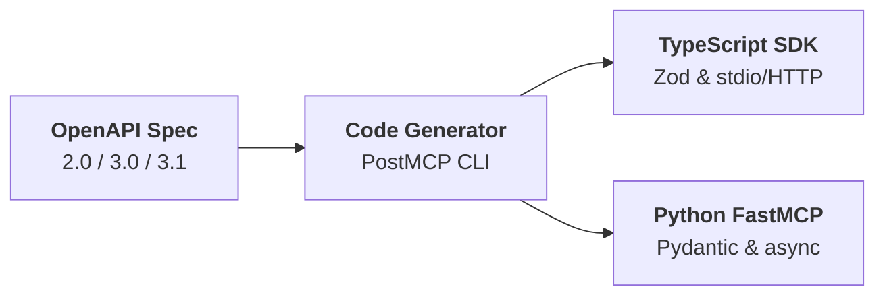

## Why Export Standalone Code?

While the PostMCP runtime proxy (`postmcp run`) is ideal for local development and desktop clients, production deployments often require:
1. **Zero External Dependencies**: Running a native binary or containerized service without a PostMCP CLI dependency.
2. **Custom Enterprise Middleware**: Adding proprietary authentication handlers, metrics, or internal tracing.
3. **Internal Code Repositories**: Checking the generated MCP server into version control and distributing it to engineering teams.

PostMCP provides first-class generators for both **TypeScript** (Node.js) and **Python**.
 


---

## Generation Commands

### TypeScript Export

```bash
postmcp generate <spec> --lang typescript --output ./mcp-ts
```

### Python Export

```bash
postmcp generate <spec> --lang python --output ./mcp-py
```

---

## Key Features of Generated Code

- **Strict Type Safety**: Generates Zod schemas (TypeScript) or Pydantic models (Python) from OpenAPI schemas.
- **Embedded Token Diet Rules**: Pre-compiles JSONPath field masks directly into the tool handlers for maximum runtime execution speed.
- **Transport Flexibility**: Ready out of the box for both stdio and SSE transport protocols.
- **Full Source Ownership**: Clean, idiomatic, commented code that you own completely.
