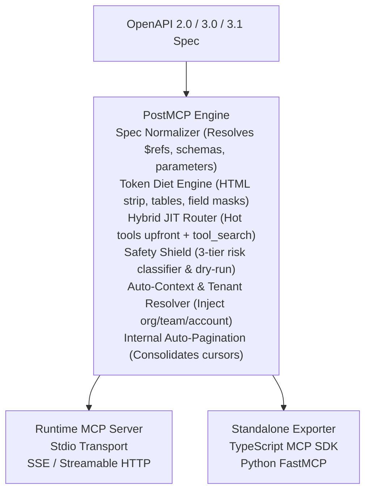

## Overview

PostMCP is a high-performance developer platform and runtime engine designed to bridge REST APIs and Large Language Model (LLM) agents. It ingests OpenAPI 2.0, 3.0, and 3.1 specifications and exposes them as Model Context Protocol (MCP) servers with zero configuration.

Raw API specifications were created for human developers, not AI context windows. A typical production OpenAPI schema for Stripe, GitHub, or Kubernetes can span hundreds of kilobytes to several megabytes, instantly exhausting context limits and driving inference costs up. PostMCP transforms these bloated schemas into lightweight, context-aware MCP tools using intelligent token pruning, dynamic hot-tool mounting, and multi-tenant context resolution.



---

## The Problem with Raw OpenAPI in LLM Agents

When developers attempt to connect AI agents directly to raw OpenAPI definitions, five systemic failure modes consistently emerge:

### 1. Context Window Exhaustion
A single large API specification can consume 50,000 to 150,000 tokens just defining tools. When an agent receives tool definitions occupying 80% of its context window, reasoning capability degrades drastically, and conversation history is truncated.

### 2. Schema Redundancy and Verbosity
OpenAPI specifications often include extensive markdown descriptions, redundant schema constraints, example payloads, and deeply nested object types. AI agents need clean parameter types and concise functional descriptions, not human-oriented marketing copy.

### 3. Missing Tenant and Identity Context
Modern APIs (such as Neon, Linear, Stripe, and Jira) are inherently multi-tenant. Requests to endpoints like `/projects` or `/issues` require an `org_id`, `team_id`, or `account_id`. When an agent invokes a tool without these identifiers, the API silently returns empty payloads (`{}`) or `404 Not Found`, leaving the agent stuck in a retry loop.

### 4. Search Friction in Pure JIT Systems
Pure Just-In-Time (JIT) tool registries expose only a meta-search tool (`tool_search`) when an API has dozens of endpoints. This forces the LLM to waste a full turn guessing search keywords just to discover fundamental operations like listing projects or retrieving user info.

### 5. Repetitive Pagination Traps
When an endpoint returns paginated data with cursor tokens (`next_cursor`), agents frequently hallucinate iterative query loops or attempt multi-turn pagination sequences that blow through output token budgets.

---

## How PostMCP Solves These Challenges

PostMCP addresses each limitation at the protocol and runtime levels:

| Capability | Mechanism | Real-World Benefit |
| :--- | :--- | :--- |
| **Token Diet Engine** | 4-tier reduction pipeline: HTML stripping, markdown table formatting, JSONPath field masking, and schema minification. | Achieves up to 93% token reduction with zero loss of critical operational fields. |
| **Hybrid JIT Router** | Analyzes endpoint graphs to pre-mount primary collection routes upfront while providing `tool_search` for edge operations. | Instant turn-1 tool execution without initial search latency. |
| **Auto-Tenant Injection** | Detects required scoping parameters and automatically resolves them from environment variables or identity lookups. | Eliminates silent empty response traps (`{}`) and 404 routing errors. |
| **Internal Auto-Pagination** | Transparently traverses cursors and pages up to configured limits, consolidating items into a single dieted response. | Prevents LLM cursor loops and multi-turn pagination hallucinations. |
| **Safety Shield** | Classifies every operation into `READ_ONLY`, `MUTATION`, or `CRITICAL` risk tiers with optional dry-run execution. | Protects production infrastructure against accidental agent destruction. |
| **Visual Web Studio** | Interactive Next.js workbench with real-time token savings analytics and live multi-provider agent sandboxes. | Enables visual curation, testing, and macro composition before deployment. |

---

## Quickstart in 30 Seconds

### 1. Run Any Spec via CLI

Execute an MCP server from any local or remote OpenAPI specification using `npx`:

```bash
# Run using stdio transport (ideal for Claude Desktop and Cursor)
npx postmcp run https://api.example.com/openapi.json

# Run a pre-tuned preset (e.g. Neon Serverless Postgres)
npx postmcp run @neon

# Run with Server-Sent Events (SSE) on a dedicated port
npx postmcp run ./swagger.yaml --transport sse --port 3001
```

### 2. Launch the Visual Web Studio

To inspect schemas, curate token diet field masks, test tools in a live sandbox, and generate standalone code:

```bash
npx postmcp studio
```

Or pass a target specification directly:

```bash
npx postmcp studio ./petstore.json
```

### 3. Generate Standalone Code

If you prefer zero runtime dependencies, generate native TypeScript or Python server code:

```bash
# Generate a TypeScript MCP server using @modelcontextprotocol/server
npx postmcp generate ./openapi.json --lang typescript --output ./mcp-server

# Generate a Python FastMCP server
npx postmcp generate ./openapi.json --lang python --output ./mcp-server
```

---

## Next Steps

Explore the core architectural components and features of PostMCP:

- [Architecture & Runtime Pipeline](/docs/architecture): Understand how requests flow through PostMCP.
- [Token Diet Engine](/docs/token-diet): Master the pruning heuristics and JSONPath masks.
- [Hybrid JIT Router](/docs/jit-router): Learn how hot tools are selected and mounted on turn 1.
- [Safety & Sandboxing](/docs/safety): Configure risk tiers and dry-run execution.
- [CLI Reference](/docs/cli): Complete guide to all flags, options, and commands.
- [Visual Web Studio](/docs/studio): Use the interactive browser workbench.
