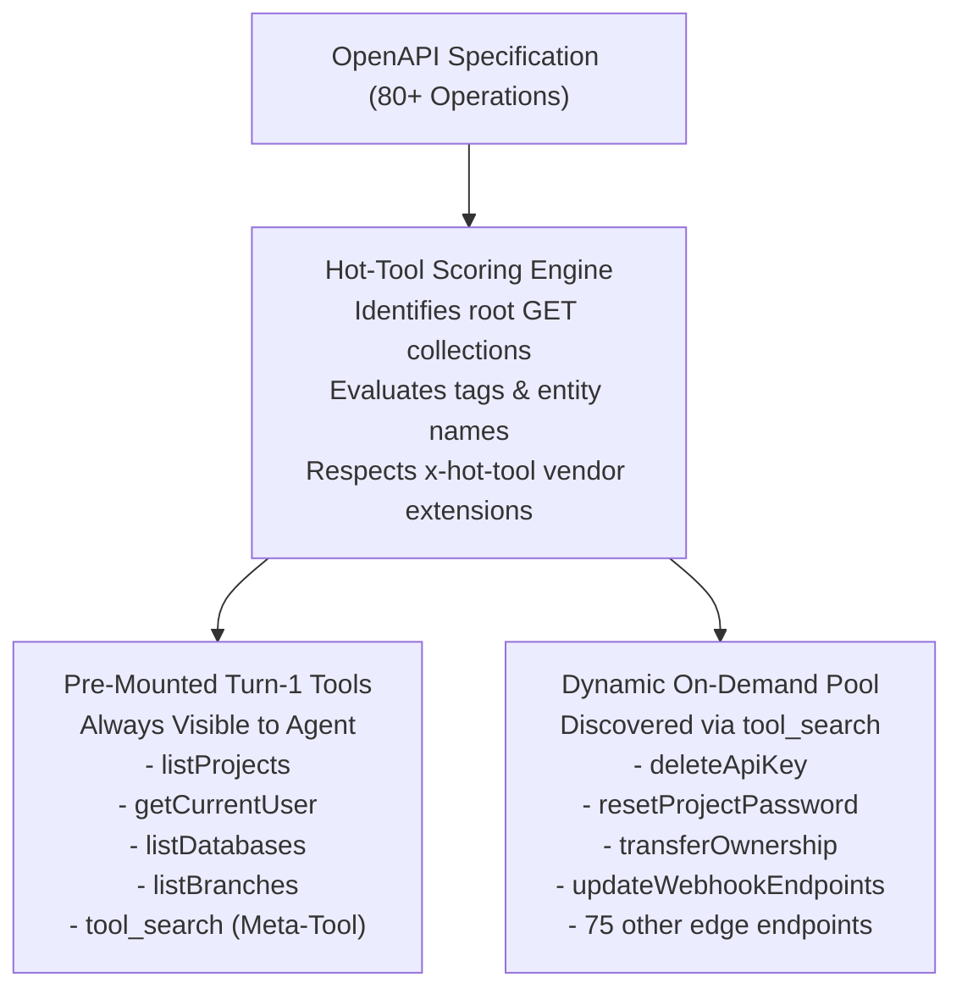

## The Flaw of Pure JIT

Many Model Context Protocol servers implemented "Just-In-Time" (JIT) tool loading to handle massive APIs. When an API has 100 endpoints, instead of mounting all 100 tools, pure JIT mounts **zero** tools and exposes only a single meta-tool: `tool_search`.

While this conserves tokens, it creates substantial friction for AI agents:
1. **Turn-1 Latency**: On turn 1, the LLM cannot perform any actual work. It must first invoke `tool_search` to find operations.
2. **Search Keyword Guessing**: If the model searches for `listUsers` but the API named the endpoint `getAccounts`, the search yields empty results and the agent stalls.
3. **Multi-Turn Cost**: Adding an extra search turn increases latency and costs on every single conversation.

---

## The PostMCP Solution: Hybrid JIT ("Hot Tools" Upfront)

PostMCP introduces **Hybrid JIT**. Instead of mounting zero tools, PostMCP analyzes the OpenAPI graph and **pre-mounts the top 5 to 7 primary root collection endpoints upfront** at server startup.

### Turn-1 Agent Experience
When Claude, Cursor, or OpenCode initializes the session, it immediately sees:
- `listProjects`: Can immediately list projects on turn 1 without searching.
- `getCurrentUser`: Can verify credentials right away.
- `tool_search`: Readily available if the user subsequently requests an advanced or edge operation.

---

## Hot-Tool Scoring Heuristics

PostMCP ranks endpoints using three criteria:

1. **Vendor Extensions (`x-hot-tool`)**: Any operation marked with `"x-hot-tool": true` in the spec receives highest priority.
2. **Root Collection Heuristic**: HTTP `GET` operations with shallow path depths (e.g. `/projects`, `/orgs`, `/databases`, `/users/me`) score higher than deeply nested mutation endpoints (e.g. `POST /v1/orgs/{id}/billing/invoices/{inv_id}/retry`).
3. **Dynamic Tag-Derived Keywords**: Automatically extracts top entity names from OpenAPI tags and matches them against standard CRUD operations (`list`, `get`, `fetch`).
