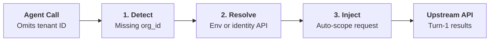

## The Empty Response Trap in Multi-Tenant APIs

Modern SaaS APIs (Neon, Linear, Stripe, Supabase, Jira, GitHub) are organized into multi-tenant hierarchies. When calling an endpoint like:

```http
GET /projects?org_id={org_id}
```

If the agent omits `org_id`, the API behaves in one of two counter-productive ways:
1. **Silent Empty Response (`{}`)**: The API routes to an empty personal default workspace with no projects, returning `{ "projects": [] }`.
2. **404 Not Found**: The API cannot resolve the unscoped resource and throws an error.

The AI agent then hallucinates that no projects exist, or gets trapped in a cycle attempting different query variations.

---

## The PostMCP Auto-Tenant Resolver

PostMCP features a built-in **Auto-Context Resolver** that detects required or recommended tenant parameters (e.g. `org_id`, `organization_id`, `team_id`, `account_id`, `owner`) and injects them transparently.



---

## Configuration

You can provide tenant mappings explicitly via CLI:

```bash
postmcp run @neon --tenant-id "org-green-forest-4912"
```

Or in `postmcp.config.json`:

```json
{
  "tenant": {
    "defaultId": "${NEON_ORG_ID}",
    "paramName": "org_id"
  }
}
```

### Supported Preset Tenant Mappings

All bundled presets come pre-configured with tenant parameter bindings:
- **Neon (`@neon`)**: Maps `org_id` to `process.env.NEON_ORG_ID`.
- **Linear (`@linear`)**: Maps `teamId` to `process.env.LINEAR_TEAM_ID`.
- **Stripe (`@stripe`)**: Maps `Stripe-Account` header to `process.env.STRIPE_ACCOUNT_ID`.
- **GitHub (`@github`)**: Maps `owner` parameter to `process.env.GITHUB_OWNER`.
