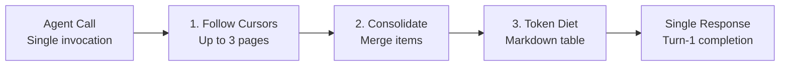

## The Infinite Pagination Loop Problem

When an API returns a paginated list with 10 items and a cursor token:

```json
{
  "items": [ ... ],
  "pagination": {
    "next_cursor": "eyJvZmZzZXQiOjEwfQ=="
  }
}
```

LLM agents routinely fall into two failure modes:
1. **Hallucinated Iteration**: The agent enters a repetitive loop, requesting page after page across 10 conversational turns, draining user patience and output token limits.
2. **Early Termination**: The agent only inspects the first 10 items, fails to notice the `next_cursor`, and erroneously tells the user that an entity does not exist.

---

## PostMCP Internal Auto-Pagination

PostMCP transparently follows pagination cursors **inside the runtime engine before returning to the LLM**.



---

## Pagination Guardrails

To prevent infinite loops when interacting with vast datasets:

- **Page Limit Ceiling**: PostMCP automatically follows pagination up to a strict ceiling (default: 3 pages).
- **Token Budget Adherence**: If the cumulative items exceed the Token Diet `maxResponseTokens` budget, internal pagination halts immediately and applies safe truncation.
- **Supported Strategies**:
  - Cursor-based pagination (`cursor`, `next_cursor`, `starting_after`).
  - Page-number pagination (`page`, `page_number`).
  - Offset/limit pagination (`offset`, `limit`, `skip`).
