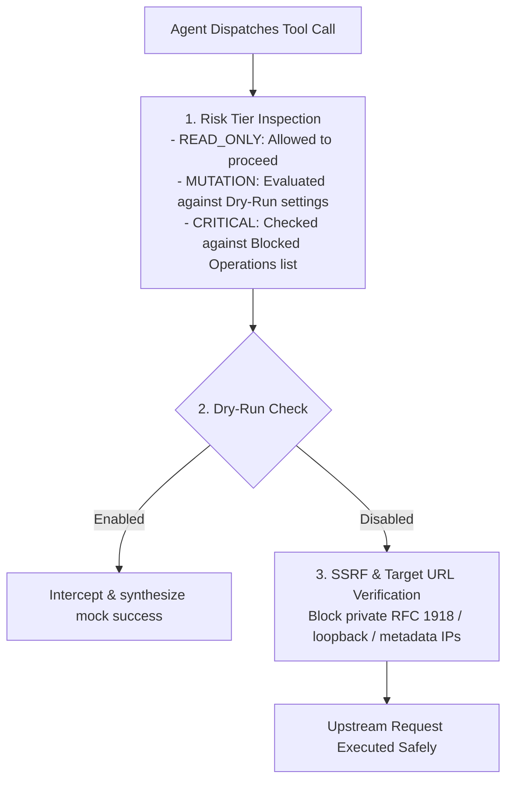

## Why Agent Safety Is Critical

Giving an autonomous LLM agent direct write access to production APIs creates real risks:
- Accidental resource deletion (e.g. dropping a production database branch or deleting an organization).
- Unintended billing charges (e.g. creating expensive GPU instances or upgrading subscription plans).
- Uncontrolled data corruption from hallucinated parameters.

PostMCP includes a multi-layered **Safety Shield** that inspects, tags, and regulates every operation before network transmission.

---

## 3-Tier Risk Classifier

Every operation parsed from an OpenAPI specification is evaluated against structural and semantic rules to assign a risk tier:

### 1. READ_ONLY
- **HTTP Methods**: `GET`, `HEAD`, `OPTIONS`.
- **Characteristics**: Idempotent, non-destructive, safe for unrestricted agent exploration.
- **Examples**: `listProjects`, `getUser`, `getInvoiceDetails`.

### 2. MUTATION
- **HTTP Methods**: `POST`, `PUT`, `PATCH`.
- **Characteristics**: Creates or modifies state. Changes can usually be reversed or inspected.
- **Examples**: `createProject`, `updateUserRole`, `addDatabaseUser`.

### 3. CRITICAL
- **HTTP Methods**: `DELETE` or operations matching destructive semantic patterns (`drop`, `terminate`, `revoke`, `purge`, `charge`, `billing`).
- **Characteristics**: Irreversible destruction, financial consequence, or credential invalidation.
- **Examples**: `deleteProject`, `dropBranch`, `createCharge`, `revokeApiKey`.

---

## Safety Enforcement Pipeline

