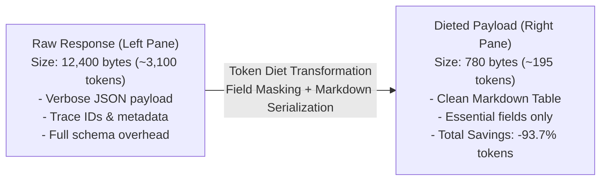

## Visual Token Optimization

The **Token Diet Curator** allows you to see the exact transformation that upstream API responses undergo before reaching the LLM.

---

## Interactive Controls

1. **Diet Level Selector**: Switch between `None`, `Minimal`, `Standard`, `Aggressive`, and `Ultra` to observe how each compression level affects the output.
2. **Custom JSONPath Field Masking**:
   - Enter a custom expression (e.g. `items[*].{id,name,branch}`) to extract exact fields.
   - Click **Apply Mask** to immediately re-render the dieted preview and recompute savings metrics.
3. **Format Toggle**:
   - Switch between **Markdown Table** and **Compact JSON** output representations.
4. **Token & Byte Metrics**:
   - Real-time token counter calculations comparing raw vs dieted tokens.
   - Displays percentage reduction and estimated API inference cost savings.
