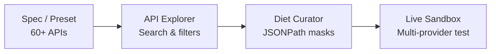

## Overview

The **PostMCP Visual Web Studio** (`@postmcp/studio`) is a modern web application built on Next.js 16 (App Router, Turbopack, React 19) and styled with Roboto typography. It provides an intuitive graphical interface for developers to inspect, optimize, test, and export MCP servers from OpenAPI specifications.

To launch the studio:

```bash
npx postmcp studio
```

---

## Studio Layout & Workspaces

The Studio interface is organized into four interconnected panels:



---

## Core Capabilities

1. **Preset Catalog & Spec Importer**:
   - Browse 60+ pre-tuned API configurations with one click.
   - Ingest raw OpenAPI specifications via URL, file upload, or direct JSON/YAML paste.
2. **API Explorer**:
   - Search across hundreds of endpoints with instant fuzzy matching.
   - Filter operations by HTTP method (`GET`, `POST`, `PUT`, `DELETE`) or Risk Tier (`READ_ONLY`, `MUTATION`, `CRITICAL`).
3. **Token Diet Curator**:
   - Visually slide between reduction levels (`none`, `minimal`, `standard`, `aggressive`, `ultra`).
   - Side-by-side before-and-after payload diff viewer with token counter calculations.
4. **Live AI Sandbox**:
   - Chat with OpenAI (`gpt-4o`, `gpt-4o-mini`), Anthropic (`claude-3-5-sonnet`), Google Gemini (`gemini-2.0-flash`), or zero-key simulated local agents.
   - Live tool invocation execution with parameter inspection and step-by-step audit traces.
5. **Code Export**:
   - Export standalone TypeScript or Python MCP repositories directly from the browser.
