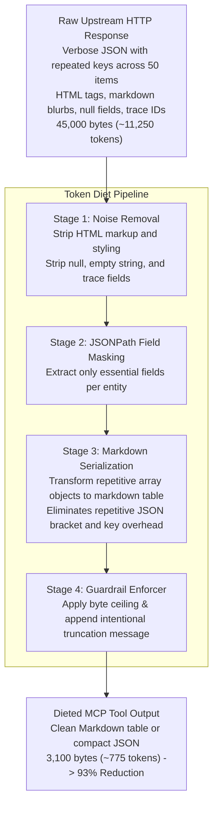

## Why Token Diet Matters

Large Language Models do not read APIs the way humans do. When an LLM receives API responses:
1. **Context Space is Zero-Sum**: Every token consumed by JSON formatting, repeated keys, null fields, and verbose metadata directly robs the agent of conversation history and reasoning capacity.
2. **Inference Latency Scales with Context**: Processing large prompt payloads introduces noticeable latency before the model can generate its next action.
3. **Financial Cost**: Commercial LLM APIs charge per token. A bloated tool response that returns 10,000 tokens on every invocation can make an automated agent prohibitively expensive to operate.

The **Token Diet Engine** is PostMCP's proprietary transformation pipeline that sits directly between upstream HTTP responses and the MCP client. It compresses and refines payloads with mathematical precision, discarding noise while strictly retaining primary semantic identifiers and values.

---

## Benchmarks & Real-World Results

Across popular enterprise and developer APIs, Token Diet achieves substantial reductions:

| Target API | Operation | Raw Tokens | Dieted Tokens | Savings |
| :--- | :--- | :--- | :--- | :--- |
| **Neon** | `listProjects` (20 projects) | 14,200 | 920 | **93.5%** |
| **Stripe** | `listCharges` (25 charges) | 28,400 | 2,100 | **92.6%** |
| **GitHub** | `listRepositoryIssues` (30 issues) | 36,000 | 3,400 | **90.5%** |
| **Linear** | `listTeamIssues` (50 issues) | 42,500 | 4,200 | **90.1%** |
| **Supabase** | `listOrganizations` | 8,800 | 780 | **91.1%** |

---

## Key Principles

- **Zero Semantic Degradation**: Field masks retain all IDs, names, statuses, and relations required for downstream tool calls.
- **Explicit Agent Signaling**: When data is trimmed, PostMCP notifies the agent with `[Data truncated by design. Total items: N]` so the agent understands the truncation is intentional.
- **Configurable per Operation**: Default global levels can be overridden with exact JSONPath queries for specific endpoints.
